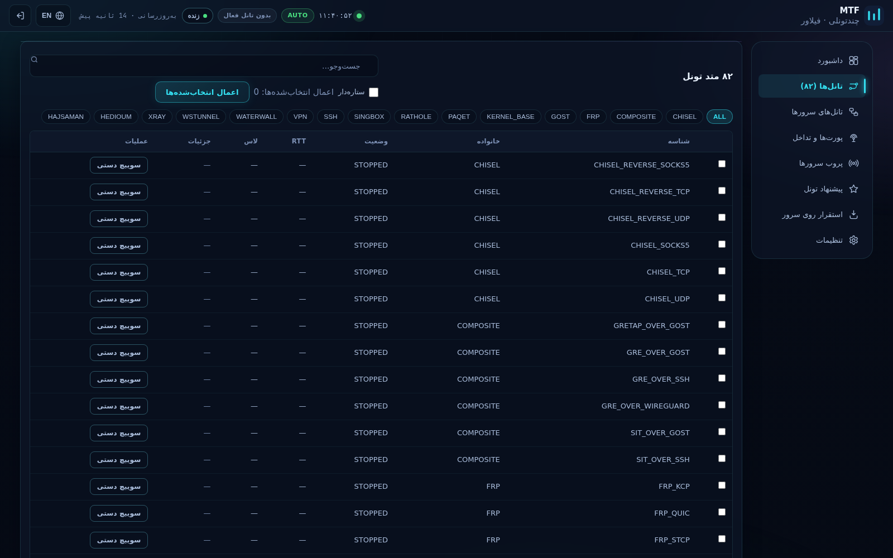

# MTF — پنل چندتونلی با فیلاور

[]() []() []() []()

> پنل کنترل self-hosted و دوزبانه (فارسی / انگلیسی) برای ساخت، تست، مانیتورینگ و
> **فیلاور خودکار ۸۲ روش تانل** (کرنلی + userspace) بین سرورهای شما — با
> **مدیریت تداخل پورت**، **مسیر‌یابی دوپشته IPv4+IPv6**، **پروب SSH** و
> **پیشنهاد هوشمند تونل**.


---

## ✨ تفاوت‌ها

| | |
|---|---|
| **۸۲ روش تانل** | WireGuard، GRE/GRETAP، SIT، IPIP، VXLAN، VTI/IPsec، L2TP، OpenVPN، SSH (۶ نوع)، GOST (۱۵)، Xray (۷)، sing-box (۵)، FRP (۶)، rathole (۵)، chisel (۶)، wstunnel (۳)، WaterWall (۳)، PAQET (۲) و ترکیبی‌ها — همه با هارنس «عبور واقعی دیتا» تأیید می‌شوند، نه فقط «پروسس بالا آمد». |
| **فیلاور واقعی** | IP مجازی (VIP `10.10.10.5`) روی جدول روتینگ `51000` سوار است و در حالت خودکار به سالم‌ترین تونل منتقل می‌شود؛ در حالت دستی با یک کلیک. |
| **بدون تداخل** | قبل از هر bind، پنل پورت‌های TCP/UDP همه سرورها **به‌علاوه فضای پروتکل IP** (GRE/IPIP/SIT/ESP) را اسکن می‌کند، ۴۸ پورت سیستمی را همیشه رزور می‌کند و پورتی انتخاب می‌کند که روی **هر دو IPv4 و IPv6** امن باشد. |
| **نصب چندتوزیعه‌ای** | نصب از طریق SSH با پکیج‌منیجر بومی مقصد: `apt`، `dnf`، `yum`، `zypper`، `pacman`، `apk` — دبیان/اوبونتو، ردهت/راک‌ای/آلما، openSUSE، آرچ و آلپاین. |
| **مانیتورینگ زنده** | نمودار CPU/RAM/ترافیک، دونات وضعیت ۸۲ متد، گیج سلامت با ناحیه آستانه، اسپارک‌لاین هر ۵ ثانیه، نقشه حرارتی آپ‌تایم ۲۰ دقیقه و دیاگرام مسیر فیلاور — همه SVG دست‌ساز و بدون CDN. |
| **رابط دوزبانه RTL/LTR** | با یک کلیک فا↔EN همراه با آینه‌شدن کامل چیدمان. فونت‌های وزیرمتن + JetBrains Mono داخل خود پنل. |

---

## 🚀 شروع سریع

```bash
# روی هر سرور لینوکسی با داکر
docker run -d --name mtf-panel \
  --privileged --network host \
  -v /opt/multitunnel/engine:/opt/multitunnel/engine \
  -v /opt/multitunnel/panel:/opt/multitunnel/panel \
  -v /opt/multitunnel/data:/opt/multitunnel/data \
  -v /opt/multitunnel/certs:/opt/multitunnel/certs \
  -v /opt/multitunnel/bin:/opt/multitunnel/bin \
  -v /opt/multitunnel/logs:/opt/multitunnel/logs \
  mtf-panel:1.0
```

پنل فقط روی **:9443** با HTTPS سرو می‌دهد. اولین ورود یک رمز تصادفی می‌سازد
(یک‌بار از `/api/password-hint` قابل دیدن است)؛ بلافاصله از
**تنظیمات → اعتبار ورود** عوضش کنید.

**نصب بدون داکر** — نصب‌کننده موتور توزیع شما را خودش تشخیص می‌دهد:

```bash
sudo bash deploy/engine/mtf/installer.sh   # apt / dnf / yum / zypper / pacman / apk
```

---

## 🧭 راهنمای رابط — تک‌تک دکمه‌ها و بخش‌ها

### ۱ · ورود


* **نام کاربری / رمز عبور** — اعتبار در `data/panel_secret.json` سمت سرور ذخیره است (از تنظیمات قابل تغییر).
* **ورود / Sign in** — ساخت کوکی نشست httponly.

### ۲ · نوار بالا (همیشه دیده می‌شود)


| کنترل | کارکرد |
|---|---|
| 🟢 نقطه نبض + ساعت | زنده‌بودن پنل + ساعت محلی. |
| نشان `AUTO` / `MANUAL` | حالت فعلی فیلاور. |
| نشان تانل فعال | کدام تونل الان VIP را حمل می‌کند یا «بدون تانل فعال». |
| دکمه **زنده / متوقف** | توقف/ادامه پولینگ ۵ ثانیه‌ای تله‌متری — طبق اصل UX ریل‌تایم: داده زنده باید دکمه توقف و برچسب زمان به‌روزرسانی داشته باشد. |
| `به‌روزرسانی · ۳ ثانیه پیش` | عمر آخرین تازه‌سازی؛ بالای ۱۶ ثانیه کهنه (زرد) می‌شود. |
| دکمه 🌐 **FA/EN** | تغییر فارسی↔انگلیسی و برگرداندن کامل چیدمان RTL↔LTR. |
| ⎋ خروج | پایان نشست. |

### ۳ · داشبورد (تب اول)


* **کارت‌های KPI با اسپارک‌لاین** — تانل فعال، VIP، آپ/کل، حالت؛ هر کارت یک اسپارک‌لاین ۴۰ نمونه‌ای (اتصال TCP، ترافیک RX، CPU، RAM).
* **سلامت میزبان — CPU/RAM** — نمودار ناحیه‌ای ۱۲۰ نقطه‌ای با برچسب مقدار روی آخرین نقطه (هرگز فقط رنگ).
* **ترافیک شبکه** — RX (توپر) و TX (خط‌چین) با خطوط راهنما.
* **دونات وضعیت ۸۲ متد** — سهم UP / تقلیل‌یافته / در حال استقرار / خطا / خاموش + جدول عددی.
* **گیج امتیاز سلامت** — ۰ تا ۱۰۰ با ناحیه‌های قرمز/زرد/سبز و عدد کنار کمان (قانون دسترس‌پذیری).
* **رویدادهای زنده** — تمام رخدادهای موتور/پروب/استقرار با نقطه شدت.
* **تأخیر بهترین تانل‌ها** — نمودار میله‌ای ۸ متد با کمترین RTT.
* **نوار آپ‌تایم زنده** *(جدید)* — ۴۰ خانه = ۲۰ دقیقه سلامت ناوگان (سبز آپ، زرد تقلیل، قرمز خطا، آبی بیکار).
* **مسیر فیلاور** *(جدید)* — سمت محلی → تانل فعال → VIP با نقطه متحرک بسته روی مسیر سبز.

### ۴ · تانل‌ها (۸۲)



| کنترل | کارکرد |
|---|---|
| **جست‌وجو** | فیلتر با شناسه متد. |
| چک‌باکس **ستاره‌دار** | فقط متدهای شاخص (HEDIOUM / HAJSAMAN / PAQET). |
| **چیپ خانواده** | GOST، XRAY، KERNEL_BASE، SSH، VPN و… جدول را فیلتر می‌کند. |
| **چک‌باکس هر ردیف** | انتخاب متد برای استقرار. |
| **اعمال انتخاب‌شده‌ها** | استقرار + تأیید عبور دیتا برای همه تیک‌خورده‌ها، ثبت رسید و سپس نشاندن VIP روی اولین متد. |
| **سوییچ دستی** (هر ردیف) | انتقال فوری VIP به آن متد و رفتن پنل به حالت دستی. |

پایین: **رسیدهای تست** — نتیجه PASS / PARTIAL / FAIL با شواهد خام آخرین اجرا.

### ۵ · تانل‌های سرورها


| کنترل | کارکرد |
|---|---|
| ردیف‌های **+ افزودن سرور** (هاست، پورت SSH، کاربر، رمز) | مقاصد اسکن/نصب. رمزها فقط در حافظه استفاده و هرگز ذخیره نمی‌شوند. |
| **اسکن همه سرورها** | شناسایی تانل‌های موجود هر سمت: اینترفیس‌های کرنلی، WireGuard، پورت‌ها، سرویس‌های systemd و پروسس‌ها — نتیجه در «تانل‌های شناسایی‌شده». |
| انتخاب **سمت A / سمت B** | دو سرِ تانل ماندگار (هر سمت می‌تواند «کانتینر پنل» باشد). |
| چک‌باکس **حالت جفتی** | نصب تانل واقعی دوطرفه به‌جای تک‌سمته. |
| **کاتالوگ + نصب موارد تیک‌خورده** | نصب ماندگار متدهای انتخابی بین A و B با پورت‌های خودکار بدون تداخل. |
| **تانل‌های نصب‌شده (کتاب)** | هر چیزی که پنل نصب کرده، با دکمه حذف ✕ هر ردیف. |

### ۶ · پورت‌ها و تداخل


| کنترل | کارکرد |
|---|---|
| **اسکن پورت‌ها** | جمع‌آوری `ss -tulnp` + پروتکل‌های سطح IP (GRE/IPIP/SIT/ESP/xfrm) روی پنل و همه سرورهای SSH. |
| TCP اشغال / UDP اشغال / پروتکل‌های IP | شمارنده هر خانواده. |
| جدول **پورت‌های شنیده‌شده** | چه کسی چه پورتی را گرفته — شفافیت کامل قبل از انتخاب. |
| **تخصیص خودکار پورت** (متد + انتقال + دکمه) | انتخاب پورت آزاد روی **همه سمت‌ها، v4 و v6**، داخل بازه `TCP 21000-25999` / `UDP 26000-29999` با رد کردن ۴۸ پورت سیستمی؛ تخصیص‌ها لیست و با ✕ قابل آزادسازی‌اند. |

### ۷ · پروب سرورها


* ردیف‌های **+ افزودن سرور** و سپس **اجرای پروب** — از راه SSH: معماری/OS، ماژول‌های کرنل (wireguard، sit، ipip، xfrm…)، باینری‌های موجود و اندازه‌گیری واقعی RTT/لاس/جیتر.
* کارت‌های **نتیجه پروب** و جدول **ماتریس قابلیت‌ها** ورودی پیشنهاددهنده‌اند.

### ۸ · پیشنهاد تونل


* **محاسبه پیشنهاد** — بهترین متد هر جفت سرور بر اساس امتیاز پروب؛ هر کارت درصد تطابق، RTT دلخواه و دلایل (معماری، ماژول‌ها، تأخیر) را نشان می‌دهد.

### ۹ · استقرار روی سرور


* هاست / پورت SSH / کاربر / رمز و دکمه **شروع استقرار** — همان هارنس تأیید ۸۲ متد را روی سرور واقعی اجرا و رسید ثبت می‌کند؛ اثبات دقیق اینکه متد روی آن هاست سر‌به‌سر کار می‌کند.

### ۱۰ · تنظیمات


* کارت **فیلاور** — سگمنت خودکار/دستی،Cooldown، هیسترزیس، آستانه‌های لاس/RTT، فاصله پروب؛ **ذخیره تنظیمات** ثبت می‌کند.
* کارت **اعتبار ورود** — نام کاربری و/یا رمز جدید؛ از ورود بعدی اعمال می‌شود.

---

## 🏗 معماری

```
┌─────────────────────── Docker: mtf-panel (privileged, host net, :9443) ───────────────────────┐
│  FastAPI (/login /api/*) ── Jinja2 + JS خالص (RTL/LTR، نمودار SVG، i18n)                       │
│     │          │                  │                        │                                   │
│ core.py FSM  probe_engine   portmgr.py          servertunnels.py        metrics.py            │
│ روتینگ VIP   اثرانگشت SSH    اسکن تداخل v4+v6   نصب ماندگار             نمونه‌گیری /proc      │
│     │          │                  │                        │                                   │
│ mtf_kernel.sh (تانل‌های کرنلی در netns)      mtf_userspace.py (رانرهای ۸۲ متد)                 │
└────────────────────────────────────────────────────────────────────────────────────────────────┘
        │ SSH                                                          ▲ پروب / نصب / اسکن
        ▼                                                              │
  سرور تست (45.141.148.59 …)  ◄──────────── هر توزیع ──────────────────┘
```

* **فیلاور VIP**: رکوردهای `ip route` در جدول `51000` عدد `10.10.10.5` را بین اینترفیس‌های تانل جابه‌جا می‌کنند؛ FSM با cooldown و هیسترزیس روی خرابی پروب واکنش نشان می‌دهد.
* **دوپشته**: لیسنرها روی `0.0.0.0` **و** `::` چک می‌شوند؛ تانل‌ها نسخه‌های IPv6 دارند (SIT، IP6GRE، IP6GRETAP، VTI6) و مدیر پورت چون bind لینوکس مشترک است، v4/v6 را یک فضای تخصیص می‌داند.

## 🧪 شواهد تست

ماتریس کامل ۸۲ متد: [docs/TEST-REPORT.md](docs/TEST-REPORT.md) —
۲۵ PASS · ۲۵ PARTIAL · ۳۲ FAIL همراه با دلیل تک‌تک (نبود ایمیج/sshd روی هارنس تست و…).

## 🔐 نکات امنیتی

* پنل فقط روی :9443 با TLS؛ کوکی نشست httponly + SameSite=Lax.
* رمز سرورها در پروب/نصب فقط در حافظه استفاده می‌شود و هرگز روی دیسک نوشته نمی‌شود.
* بلافاصله اعتبار پیش‌فرض را عوض کنید (تنظیمات → اعتبار ورود) و هر رازی که در چت یا اسکرین‌شات ظاهر شده را بچرخانید.

## 📄 لایسنس

MIT — فونت‌ها تحت SIL OFL (وزیرمتن، JetBrains Mono).
