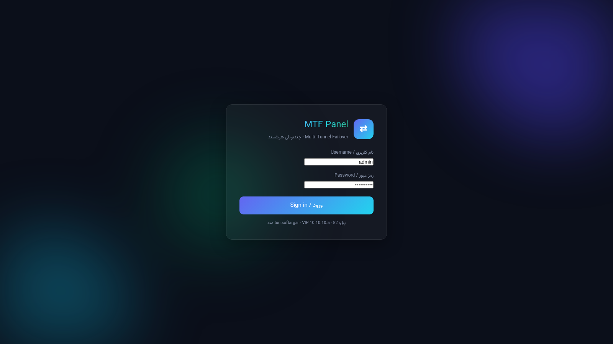
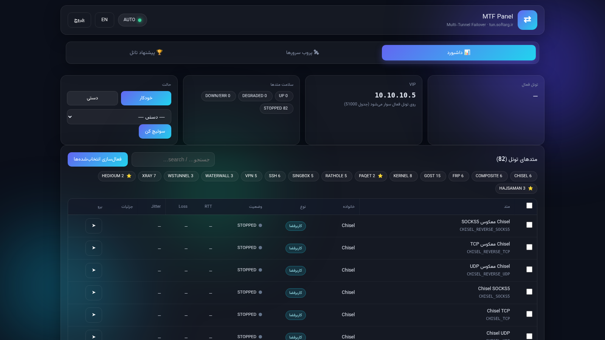
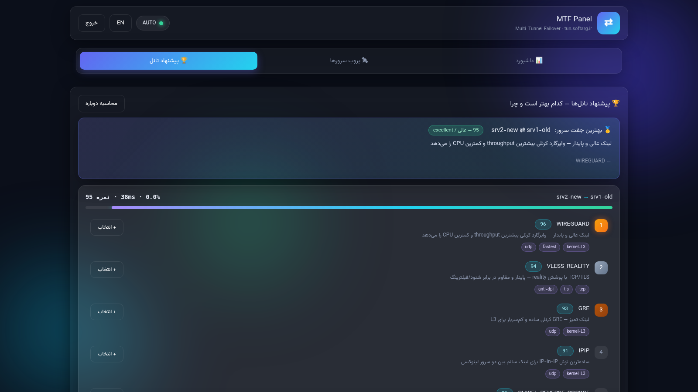
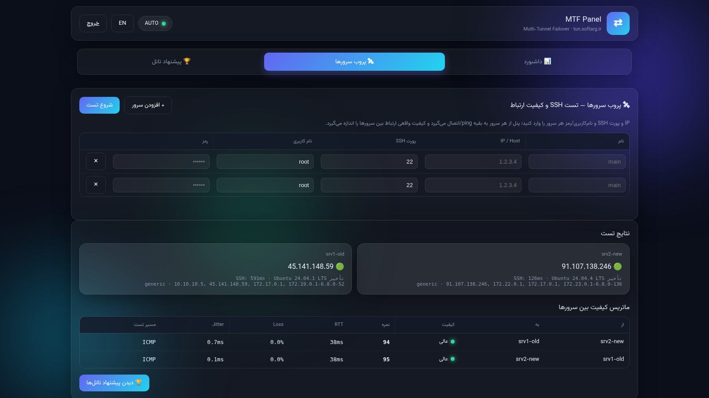
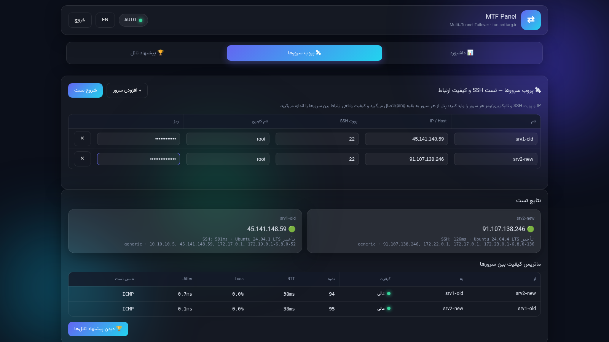

# MTF — سیستم چندتونلی با فیلاور (Multi-Tunnel Failover)

> [English](README.md) | **فارسی**

سیستم حرفه‌ای فیلاور چندتونلی: **۸۲ متد تونل**، موتور پروب (تست) سرورها از طریق SSH، موتور پیشنهاد تونل، و پنل وب دوزبانه (فارسی/انگلیسی با RTL/LTR) با تم نئون تیره — همه در **یک کانتینر داکر ایزوله** که هرگز با سرویس‌های دیگر روی سرور تداخل ندارد.

**پنل زنده:** `https://tun.softarg.ir:9443`

---

## 📸 اسکرین‌شات‌ها — پروب واقعی دو سرور زنده

| ورود | داشبورد (۸۲ متد) |
|---|---|
|  |  |

| پروب SSH — ماتریس زوج‌سرور (لاس ۰٪، RTT 38ms، امتیاز ۹۵) | پیشنهادها (رتبه‌بندی + دلیل) |
|---|---|
|  |  |

| فرم پروب (۲ سرور واقعی) | پرشده قبل از تست |
|---|---|
|  |  |

---

## ✨ امکانات

### 🧩 ۸۲ متد تونل (۱۳ خانواده)
تونل‌های فضای کرنل و یوزراسپیس، شامل سه متد اختصاصی پرچم‌دار:

| خانواده | توضیح |
|---|---|
| **HEDIOUM** (Pool/Tunnel) | باینری اختصاصی Go — استخر SOCKS + حالت TUN |
| **HAJSAMAN** (SIT/WG/FULL) | تونل‌های اسکریپتی اختصاصی |
| **PAQET** (RAW/KCP/SOCKS5) | ترنسپورت شتاب‌یافته QUIC/KCP |
| GOST | ۱۵ متد — رله/socks/http/ss چندپروتکلی |
| FRP | ۶ متد — ریورس پراکسی سریع |
| RATHOLE | ۵ متد — ریورس پراکسی سبک مبتنی بر Rust |
| CHISEL | ۶ متد — تونل HTTP روی TCP/UDP |
| WSTUNNEL | ۳ متد — تونل WebSocket+QUIC |
| VPN | ۵ متد — OpenVPN / WireGuard / IKEv2 / L2TP |
| XRAY | ۷ متد — VLESS/VMess/Trojan/Reality |
| SING-BOX | ۵ متد — پراکسی جهانی مدرن |
| WATERWALL | ۳ متد — پروتکل اختصاصی ضد DPI |
| COMPOSITE | ۶ متد — تونل‌های زنجیره‌ای چندهاپ |
| KERNEL (SIT/GRE/IPIP/VXLAN/VTI…) | ۸ متد — تونل واقعی کرنل با netns |

### 🔍 موتور پروب سرور (SSH Probe)
- هر تعداد سرور را اضافه کنید (نام / IP / پورت SSH / یوزر / پسورد)
- پروب همزمان: تأخیر SSH، کرنل، سیستم‌عامل، آپتایم، IPها
- **ماتریس کیفیت زوج‌به‌زوج** (ICMP با fallback به TCP): درصد پکت‌لاس، RTT، جیتر
- پسوردها فقط در حافظه استفاده می‌شوند — **هرگز روی دیسک ذخیره نمی‌شوند**

### 🎯 موتور پیشنهاد تونل
برای هر جفت‌سرور، هر ۸۲ متد را امتیازدهی می‌کند و پاسخ می‌دهد:
- *کدام تونل‌ها می‌توانند این دو سرور را به هم وصل کنند؟*
- *کدام یک بهترین است و **چرا*** (توضیح فارسی + انگلیسی، تگ‌ها، درصد تطابق)
- قوانین: امتیاز بالا + UDP → WireGuard/GRE/IPIP · پکت‌لاس → Hedioum/WaterWall/paqet · جیتر → paqet/wstunnel · UDP فیلتر → chisel/gost · سه متد پرچم‌دار همیشه لیست می‌شوند

### 🔁 فیلاور (Failover)
- **حالت خودکار**: مانیتورینگ سلامت با FSM و debounce، سوییچ خودکار به بهترین تونل
- **حالت دستی**: انتخاب با یک کلیک از کارت‌های پیشنهاد
- **فیلاور VIP**: آی‌پی مجازی `10.10.10.5` همراه تونل فعال جابه‌جا می‌شود (policy routing، جدول 51000)

### 🌐 رابط کاربری پنل
- طراحی شیشه‌ای نئون تیره، دوزبانه **فارسی/انگلیسی با سوییچ کامل RTL/LTR**
- پولینگ زنده هر ۳ ثانیه، تب‌ها: داشبورد / پروب سرور / پیشنهادها
- ورود با یوزرنیم + پسورد، کوکی سشن، TLS (سرتیفیکیت وایلدکارد)

---

## 🚀 استقرار

سیستم به‌صورت **یک کانتینر ایزوله** (`mtf-panel`) روی شبکه داکر اختصاصی (`mtfnet`) اجرا می‌شود و فقط پورت **9443** منتشر می‌شود. به هیچ سرویس دیگری روی هاست دست زده نمی‌شود.

```bash
# ساختار (bind mount)
/opt/multitunnel/
├── engine/     # موتور FastAPI: api.py, probe_engine.py, core.py, state.py, registry.py
├── panel/      # قالب‌ها + استاتیک (رابط چندزبانه)
├── methods/    # اجراکننده‌ها: mtf_kernel.sh (netns), mtf_userspace.py
├── bin/        # باینری‌ها: hedioum, paqet, rathole, wstunnel, waterwall, tuic,
│               #   xray, sing-box, gost, chisel, frps/frpc, hysteria
├── certs/      # panel.pem / panel-key.pem (وایلدکارد *.softarg.ir)
├── data/       # panel_secret.json, STATUS.json, probe_last.json, رسیدها
└── logs/
```

```bash
docker run -d --name mtf-panel \
  --network mtfnet --privileged \
  -p 9443:9443 \
  -v /opt/multitunnel/engine:/opt/multitunnel/engine \
  -v /opt/multitunnel/panel:/opt/multitunnel/panel \
  -v /opt/multitunnel/methods:/opt/multitunnel/methods \
  -v /opt/multitunnel/bin:/opt/multitunnel/bin \
  -v /opt/multitunnel/certs:/opt/multitunnel/certs \
  -v /opt/multitunnel/data:/opt/multitunnel/data \
  -v /opt/multitunnel/logs:/opt/multitunnel/logs \
  mtf-panel:2.0
```

> `--privileged` فقط برای خانواده تونل‌های کرنلی لازم است (netns / WireGuard / GRE…).

### ورود پیش‌فرض
```
آدرس:    https://tun.softarg.ir:9443
یوزرنیم:  admin
پسورد:    (در فایل /opt/multitunnel/data/panel_secret.json تنظیم شده)
```

---

## 🧪 نحوه استفاده

1. **ورود** → داشبورد وضعیت زنده هر ۸۲ متد را نشان می‌دهد (چک‌باکس = فعال‌سازی).
2. **تب پروب سرور** → ردیف سرورها را پر کنید (نام/IP/پورت SSH/یوزر/پسورد) → *شروع پروب*.
   ماتریس، پکت‌لاس/RTT/جیتر زوج‌سرورها و امتیاز سلامت را نشان می‌دهد.
3. **تب پیشنهادها** → اول بهترین جفت، بعد یک کارت برای هر جفت‌سرور:
   متدهای رتبه‌بندی‌شده با درصد تطابق، مدال 🥇🥈🥉، دلیل فارسی/انگلیسی، و دکمه **انتخاب** با یک کلیک.
4. سوییچ فیلاور **خودکار/دستی** را از داشبورد تغییر دهید؛ VIP `10.10.10.5` دنبال می‌رود.

**فرمول امتیاز:** `score = 100 − loss×1.8 − min(rtt/8, 35) − min(jitter×1.2, 20)`

---

## 🔐 نکات امنیتی
- پنل پشت TLS است؛ بلافاصله پس از اولین ورود، رمز ادمین را عوض کنید (`POST /api/credentials`).
- اطلاعات پروب هرگز روی دیسک ذخیره نمی‌شود؛ فقط نتایج تجمعی (`probe_last.json`) نگه‌داری می‌شود.
- فایروال طوری تنظیم شود که فقط `9443/tcp` به پنل باز باشد.

## 📄 لایسنس
پروژه داخلی — DashSaman. تمام حقوق محفوظ است.
