# MTF — Multi-Tunnel Failover Panel

[]() []() []() []()

> A self-hosted, bilingual (فارسی / English) control panel that builds, tests,
> monitors and **auto-fails-over 82 tunnel methods** (kernel + userspace) between
> your servers — with a built-in **port-conflict manager**, **IPv4+IPv6 dual-stack
> routing**, **SSH probe** and **smart tunnel recommendation**.

## ⚡ Quick install (tested on Ubuntu 22.04/24.04, Debian 11/12)

```bash
curl -fsSL https://raw.githubusercontent.com/DashSaman/TunnelPannel/main/install.sh | sudo bash
```

One command installs the canonical application: dependencies → `/opt/tunnelpannel` →
generated secrets/RBAC tokens (shown **once**) → database migrations → systemd
service `tunnelpannel-api` → real HTTP health check → install receipt.
Re-running the same command **reconciles** (idempotent — never resets credentials
or data). Verified in CI on every push (fresh install → health → second run →
backup/mutate/restore → safe uninstall with unrelated-interface survival).

- Panel/API: `http://127.0.0.1:8080` · Upgrade: `sudo bash scripts/upgrade.sh`
- Backup/restore: `scripts/backup.sh` / `scripts/restore.sh` · Uninstall: `scripts/uninstall.sh`
- Runs `main` (development mode) by default; pin a release with
  `TUNNELPANNEL_VERSION=vX.Y.Z sudo -E bash install.sh`.

### Documentation map — read this first

This repository currently contains **two coexisting systems** (see
[docs/development/CURRENT_STATE.md](docs/development/CURRENT_STATE.md) for the full audit):

| Docs | System | What it is |
|---|---|---|
| `README.md` (this file) + [`README-fa.md`](README-fa.md) | **MTF panel** (`deploy/`) | 82-method test/failover panel on `:9443` |
| [`README.fa.md`](README.fa.md) | **NetAuto/TehranNetwork platform** (`backend/`, `plan_executor/`, `bot/`, …) | Control plane that **persistently deploys 77 methods** over SSH |

Method counts, honestly: the NetAuto engine (`plan_executor/executor.py`) deploys **77**
persistent tunnel methods; the MTF registry (`deploy/methods_registry.json`) tests **82**
entries (the 77 + HAJSAMAN ×3 + HEDIOUM ×2 test-only flagships). Canonical catalog
unification is tracked in [docs/development/CATALOG_INVENTORY.md](docs/development/CATALOG_INVENTORY.md).

Disaster recovery (NetAuto stack): [`scripts/export-production-state.sh`](scripts/export-production-state.sh)
and [`scripts/restore-production-state.sh`](scripts/restore-production-state.sh) —
encrypted full-state export/restore.

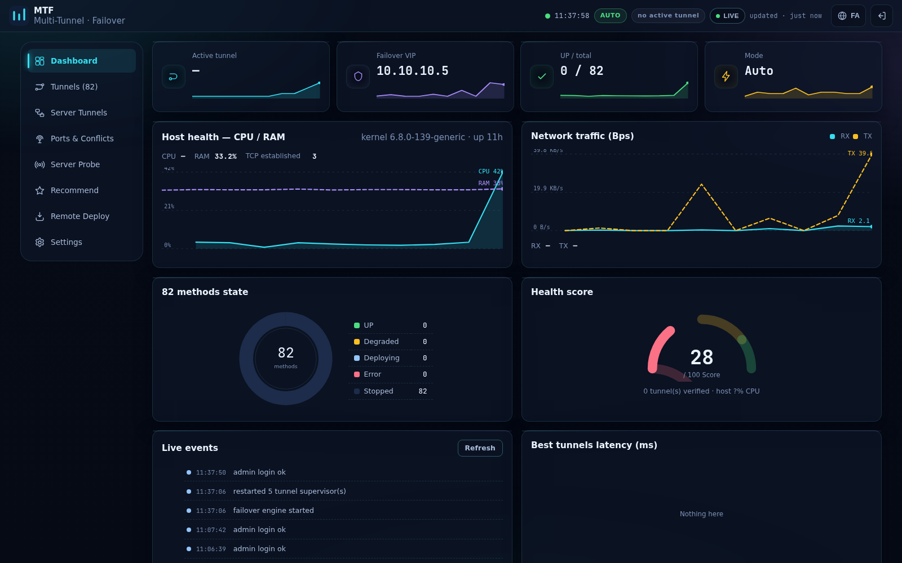

---

## ✨ What makes it different

| | |
|---|---|
| **82 tunnel methods** | WireGuard, GRE/GRETAP, SIT, IPIP, VXLAN, VTI/IPsec, L2TP, OpenVPN, SSH (6 kinds), GOST (15), Xray (7), sing-box (5), FRP (6), rathole (5), chisel (6), wstunnel (3), WaterWall (3), PAQET (2) + composites — every one verified by a real data-through test harness, not just "process started". |
| **Real failover** | A virtual IP (VIP `10.10.10.5`) rides policy-routing table `51000` and is re-pointed to the best healthy tunnel automatically (auto mode) or by hand (manual mode). |
| **Conflict-safe by design** | Before anything binds, the panel scans every server's TCP/UDP listeners *plus* IP-protocol space (GRE/IPIP/SIT/ESP), never allocates 48 system ports, and picks a free port that is safe on **both IPv4 and IPv6**. |
| **Multi-distro installs** | Installs over SSH using the target's native package manager: `apt`, `dnf`, `yum`, `zypper`, `pacman`, `apk` — Debian/Ubuntu, RHEL/Rocky/Alma, openSUSE, Arch, Alpine all supported. |
| **Live monitoring** | CPU/RAM/traffic charts, method-state donut, health gauge with threshold zones, per-5s sparklines, a 20-minute uptime heatmap and a failover-path diagram — zero CDN, fully self-drawn SVG. |
| **Bilingual RTL/LTR UI** | One click switches فا↔EN including full RTL mirroring. Bundled Vazirmatn + JetBrains Mono, no external requests. |

---

## 🚀 Quick start

```bash
# on any Linux server with Docker
docker run -d --name mtf-panel \
  --privileged --network host \
  -v /opt/multitunnel/engine:/opt/multitunnel/engine \
  -v /opt/multitunnel/panel:/opt/multitunnel/panel \
  -v /opt/multitunnel/data:/opt/multitunnel/data \
  -v /opt/multitunnel/certs:/opt/multitunnel/certs \
  -v /opt/multitunnel/bin:/opt/multitunnel/bin \
  -v /opt/multitunnel/logs:/opt/multitunnel/logs \
  mtf-panel:1.0
```

The panel serves HTTPS on **:9443** only. First login generates a random admin
password (shown once via `/api/password-hint`); change it in **Settings → Login
credentials** immediately.

**Installing tunnel methods on remote servers** — from the panel (**Server Tunnels** tab)
the engine installs over SSH using the target's native package manager
(`apt`, `dnf`, `yum`, `zypper`, `pacman`, `apk` — see `deploy/engine/mtf/servertunnels.py`).
There is no standalone bare-metal installer script; the supported deployment paths are the
Docker container above and the panel-driven remote installer.
`deploy/engine/mtf/installer.py` is the remote 82-method verification harness driver used
by the **Remote Deploy** tab, not a host installer.

---

## 🧭 UI guide — every button & section

### 1 · Login

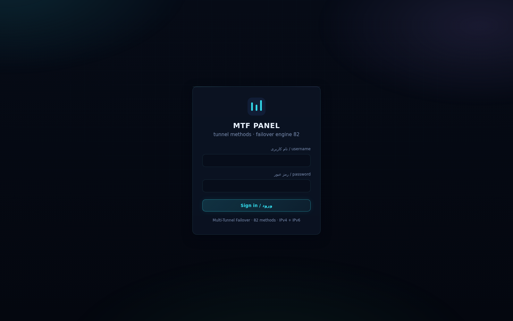

* **username / password** — credentials stored server-side in `data/panel_secret.json` (changeable in Settings).
* **ورود / Sign in** — starts an httponly session cookie.

### 2 · Top bar (always visible)

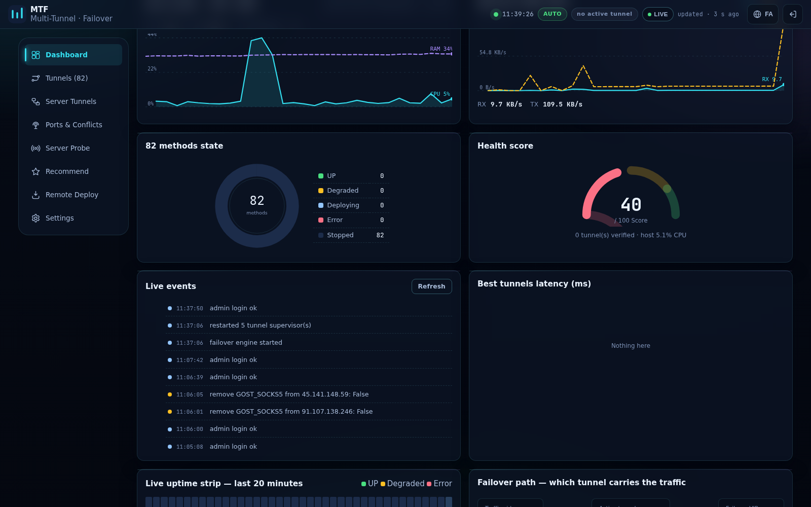

| Control | What it does |
|---|---|
| 🟢 pulse dot + clock | Panel liveness + local time. |
| `AUTO` / `MANUAL` badge | Current failover mode. |
| active-tunnel badge | Which tunnel currently carries the VIP, or "no active tunnel". |
| **LIVE / PAUSED** button | Pauses or resumes the 5-second telemetry polling — per the real-time UX rule that live data must have an update timestamp and a pause control. |
| `updated · 3s ago` | Age of the last telemetry refresh; turns amber when stale (>16 s). |
| 🌐 **FA/EN** button | Switches Persian ↔ English and flips the whole layout RTL ↔ LTR. |
| ⎋ logout | Ends the session. |

### 3 · Dashboard (first tab)

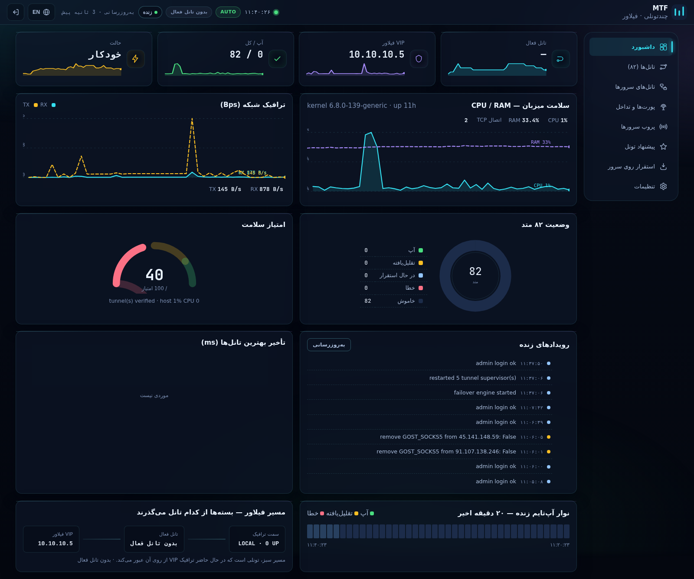

* **KPI cards with sparklines** — active tunnel, failover VIP, UP/total, mode; each card carries a 40-sample sparkline (TCP established, RX throughput, CPU, RAM).
* **Host health — CPU / RAM** — 120-point area chart, direct value labels on the newest point (never color-only).
* **Network traffic** — RX (solid) vs TX (dashed) with hover-readable y-grid.
* **82 methods state donut** — share of UP / Degraded / Deploying / Error / Stopped with a numeric legend table.
* **Health score gauge** — 0–100 with red/amber/green threshold zones and the score written beside the arc (accessibility rule: never color alone).
* **Live events timeline** — every engine/probe/deploy event with severity dots.
* **Best tunnels latency** — bar chart of the 8 lowest-RTT probed methods.
* **Live uptime strip** *(new)* — 40 cells = last 20 minutes of fleet health (green UP, amber degraded, red error, blue idle).
* **Failover path** *(new)* — local side → active tunnel → VIP with an animated packet dot on the green path.

### 4 · Tunnels (82)

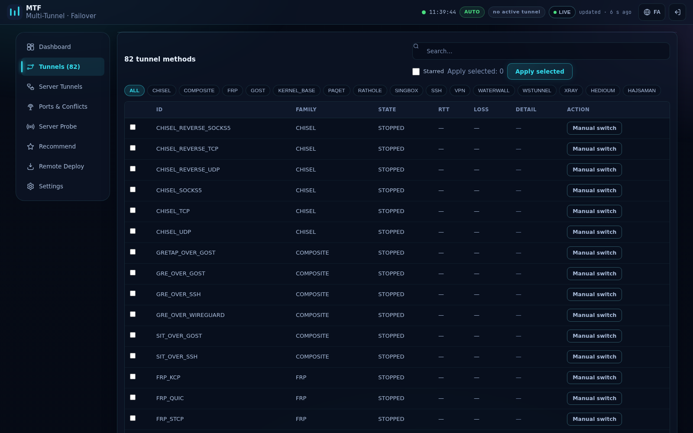

| Control | What it does |
|---|---|
| **Search box** | Filters by method ID. |
| **Starred checkbox** | Shows only the flagship methods (HEDIOUM / HAJSAMAN / PAQET). |
| **Family chips** | GOST, XRAY, KERNEL_BASE, SSH, VPN, … filter the table. |
| Row **checkbox** | Selects methods for deployment. |
| **Apply selected** | Deploys + data-verifies every ticked method, records a receipt, then points the VIP at the first deployed method. |
| **Manual switch** (per row) | Points the VIP at that method immediately and flips the panel to manual mode. |

Below: **Test receipts (latest)** — PASS / PARTIAL / FAIL verdicts with raw evidence from the last run.

### 5 · Server Tunnels

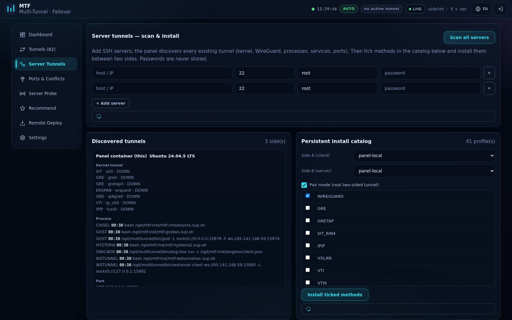
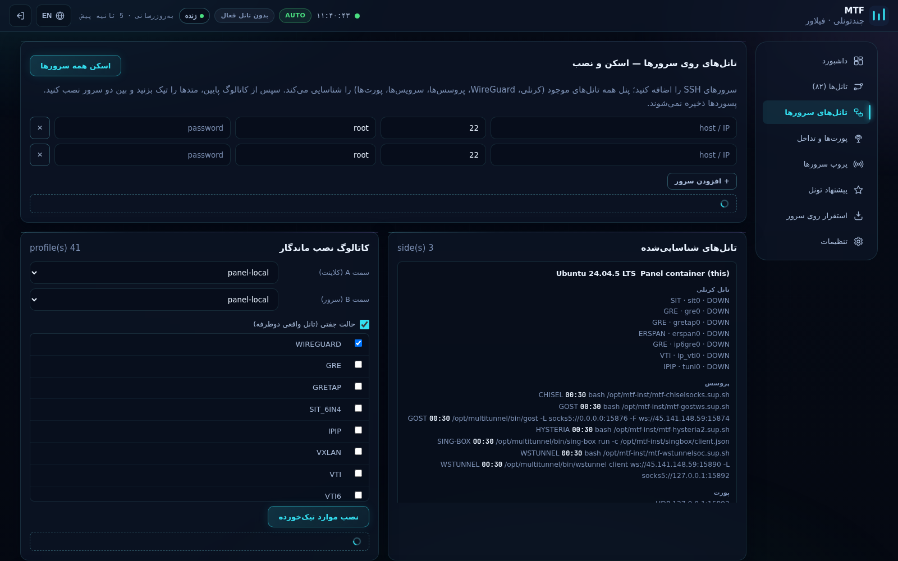

| Control | What it does |
|---|---|
| **+ Add server** rows (host, SSH port, user, password) | Targets to scan / install on. Passwords are used in-memory and never persisted. |
| **Scan all servers** | Discovers existing tunnels on every side: kernel interfaces, WireGuard, listening ports, systemd services, processes — results appear under *Discovered tunnels*. |
| **Side A / Side B selectors** | Picks the two ends of a persistent tunnel (either side may be "panel container"). |
| **Pair mode checkbox** | Installs a real two-sided tunnel instead of single-end. |
| **Catalog checkboxes + Install ticked methods** | Provisions the selected methods persistently between A and B with auto-allocated conflict-free ports. |
| **Installed tunnels (book)** | Everything installed by the panel, with a per-row ✕ remove button. |

### 6 · Ports & Conflicts

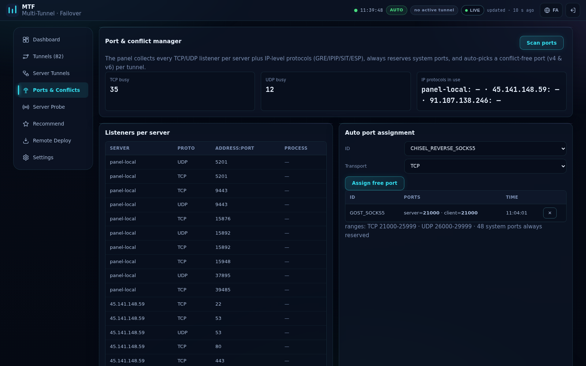
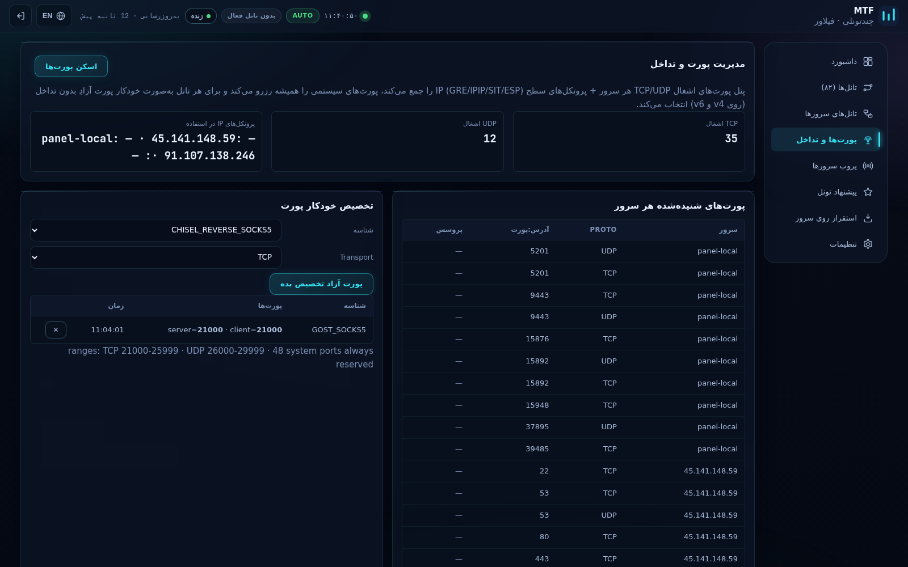

| Control | What it does |
|---|---|
| **Scan ports** | Collects `ss -tulnp` listeners + IP-protocol usage (GRE/IPIP/SIT/ESP/xfrm) on panel + all SSH servers. |
| TCP busy / UDP busy / IP protocols | Counters per family. |
| **Listeners per server** table | Who binds what — full transparency before you pick ports. |
| **Auto port assignment** (method + transport + *Assign free port*) | Chooses a port free on **all sides, v4 and v6**, inside `TCP 21000-25999` / `UDP 26000-29999`, skipping 48 reserved system ports; allocations are listed and releasable with ✕. |

### 7 · Server Probe

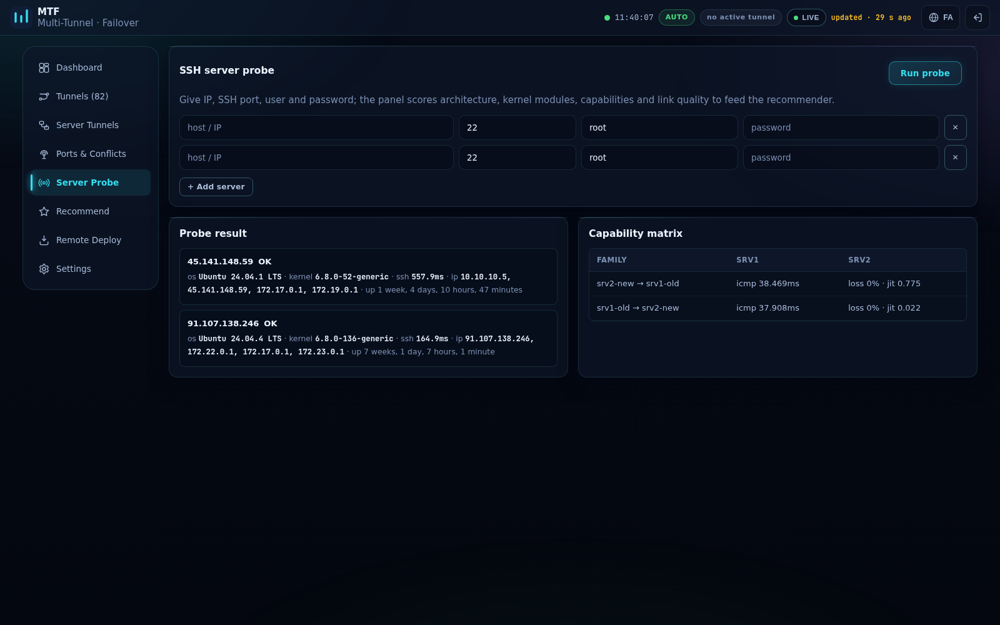
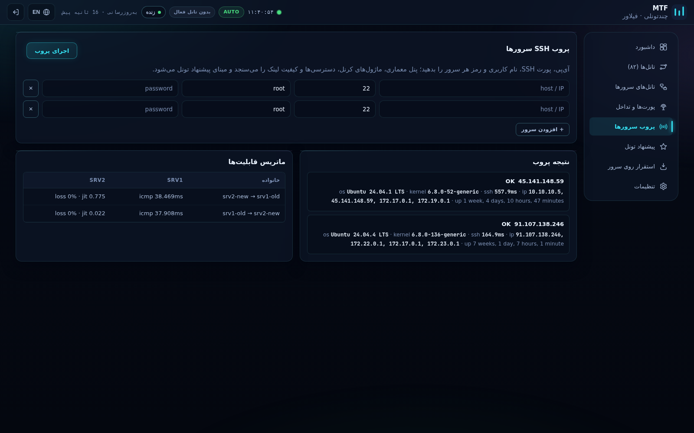

* **+ Add server** rows, then **Run probe** — SSHes in, fingerprints OS/arch, kernel modules (wireguard, sit, ipip, xfrm…), available binaries, and measures real link RTT/loss/jitter.
* **Probe result** cards + **Capability matrix** table feed the recommender.

### 8 · Recommend

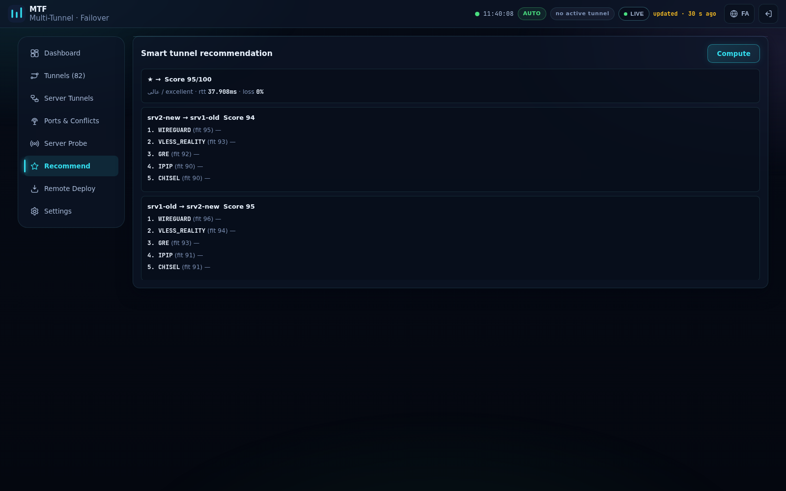

* **Compute** ranks the best method per server pair using probe scores — each card shows fit %, expected RTT and the reasons (architecture, modules, latency).

### 9 · Remote Deploy

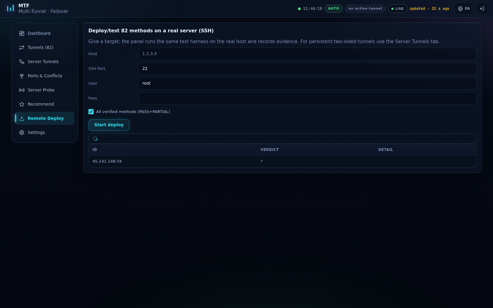

* Host / SSH port / user / password + **Start deploy** runs the *same* 82-method verification harness against a real server over SSH and records receipts — the exact proof that a method works end-to-end on that host.

### 10 · Settings

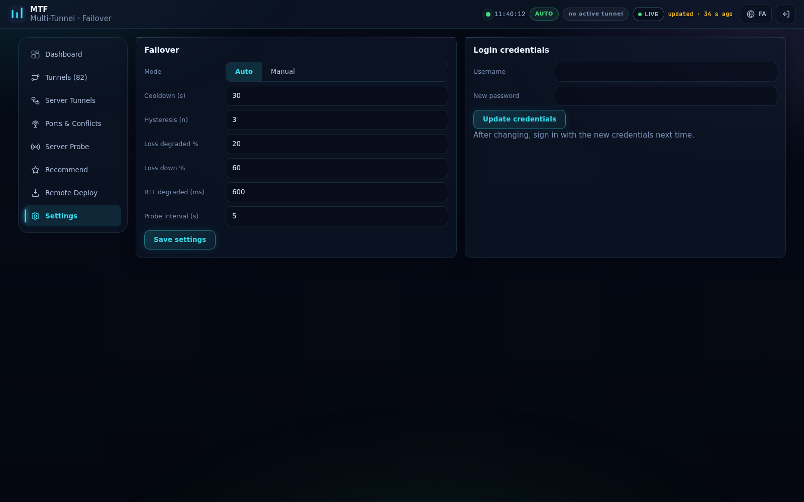
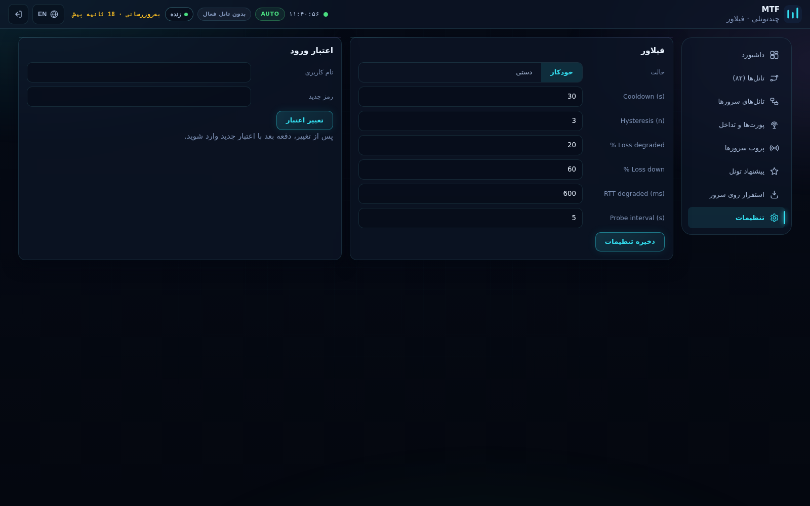

* **Failover card** — auto/manual segment, cooldown seconds, hysteresis, loss/RTT degradation thresholds, probe interval; **Save settings** persists them.
* **Login credentials card** — new username and/or password; takes effect on next login.

---

## 🏗 Architecture

```
┌────────────────────────── Docker: mtf-panel (privileged, host net, :9443) ─────────────────────────┐
│  FastAPI  (/login /api/*)  ──  Jinja2 + vanilla JS (RTL/LTR, SVG charts, i18n)                      │
│      │            │                    │                        │                                   │
│  core.py FSM  mtf/probe_engine   mtf/portmgr.py        mtf/servertunnels.py  mtf/metrics.py        │
│  VIP routing  SSH fingerprint    conflict scan v4+v6   persistent installs   /proc sampling        │
│      │            │                    │                        │                                   │
│  mtf_kernel.sh (kernel tunnels in netns)      mtf_userspace.py (82-method runners)                 │
└────────────────────────────────────────────────────────────────────────────────────────────────────┘
        │ SSH                                                          ▲ probe / install / scan
        ▼                                                              │
  test server (45.141.148.59 …)  ◄──────────────── any distro ─────────┘
```

* **VIP failover**: `ip route` entries in table `51000` move `10.10.10.5` between tunnel interfaces; the FSM re-points it on probe failure with cooldown + hysteresis.
* **Dual-stack**: listeners are checked on `0.0.0.0` **and** `::`; tunnels offer IPv6 flavors (SIT, IP6GRE, IP6GRETAP, VTI6) and the port manager treats v4/v6 as one allocation space because Linux binds are shared.

## 🧪 Test evidence

Full 82-method test matrix: [docs/TEST-REPORT.md](docs/TEST-REPORT.md) —
25 PASS · 25 PARTIAL · 32 FAIL with per-method reasons (missing images/sshd on
the test harness, etc.).

## 🔐 Security notes

* Panel binds **only** :9443 with TLS; session cookie is httponly + SameSite=Lax.
* Server passwords given to the probe/installer are used in-memory and never written to disk.
* Change the default credentials immediately (Settings → Login credentials) and rotate any secret that ever appeared in a chat or screenshot.

## 📄 License

MIT — fonts bundled under the SIL OFL (Vazirmatn, JetBrains Mono).
