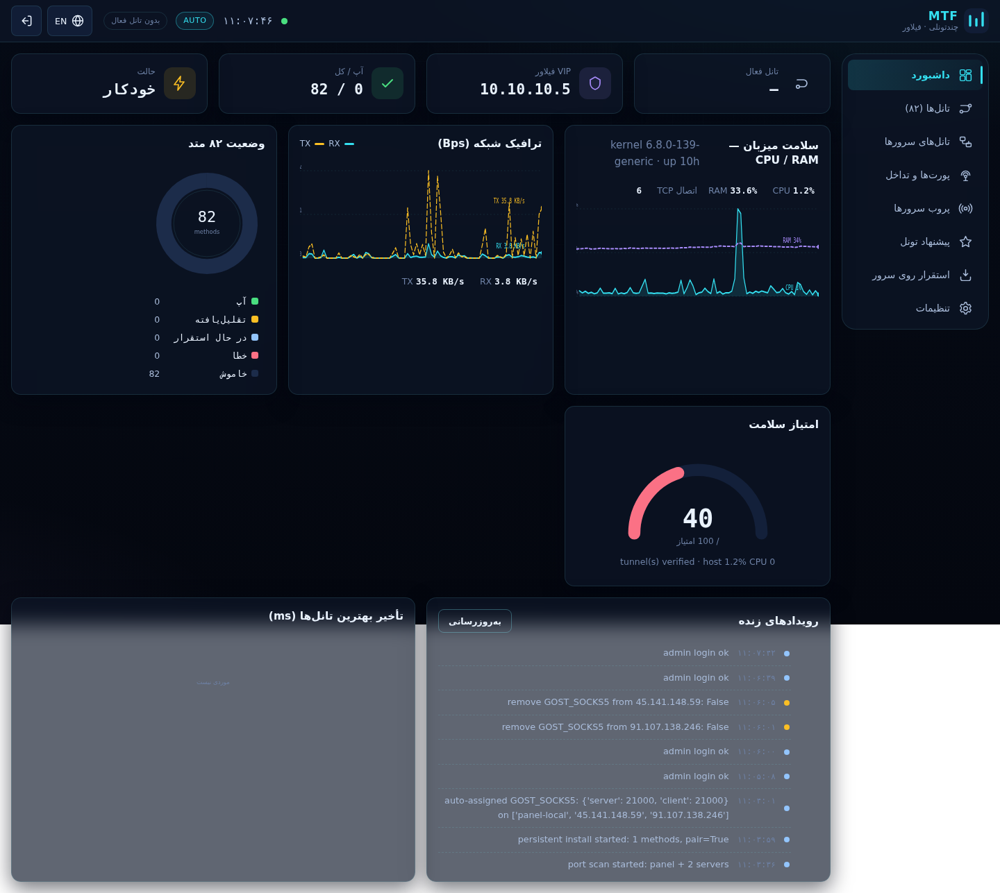
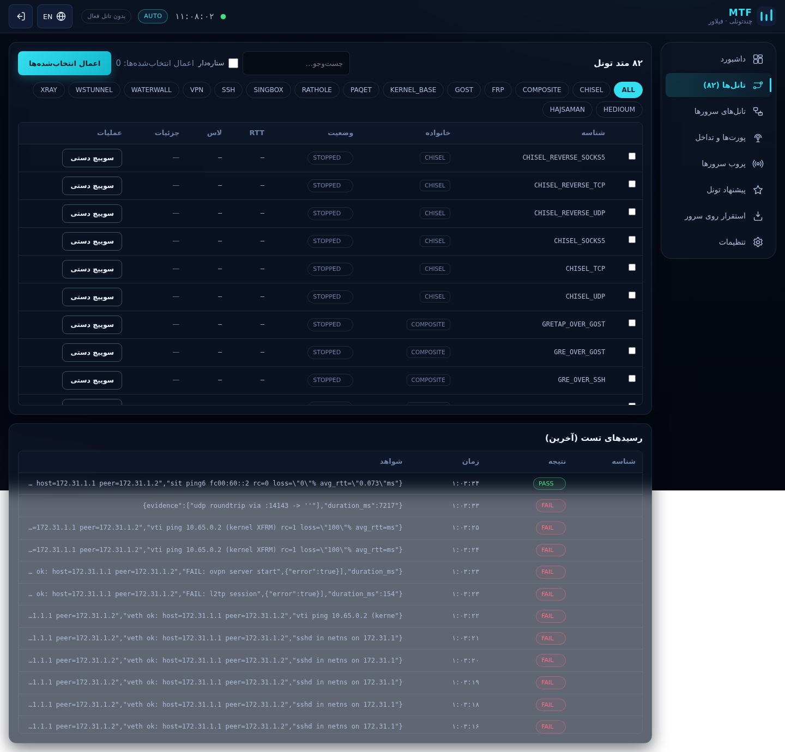
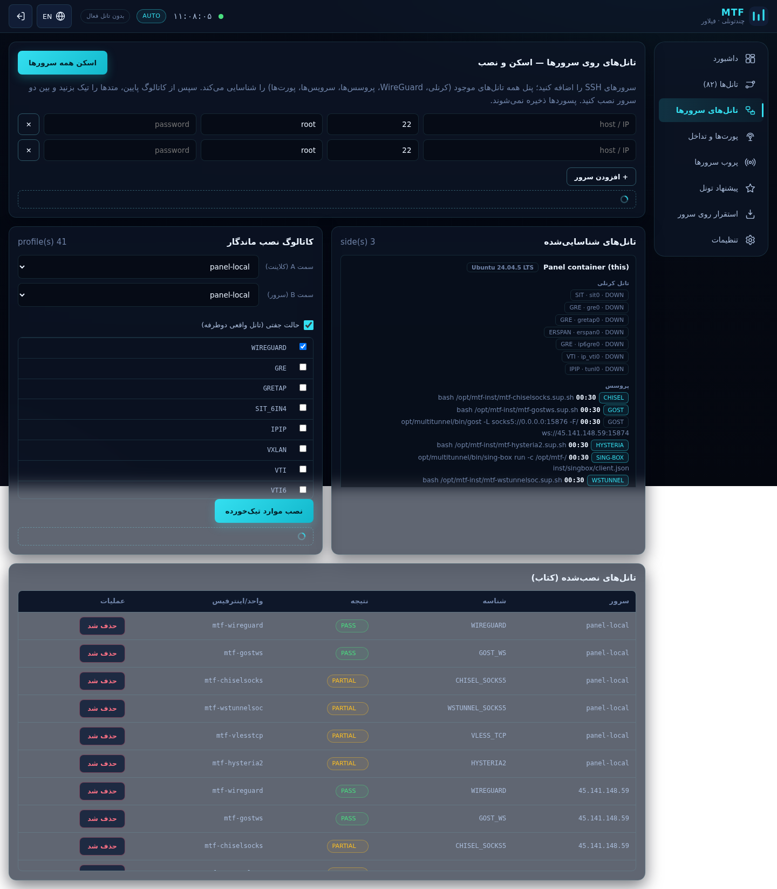
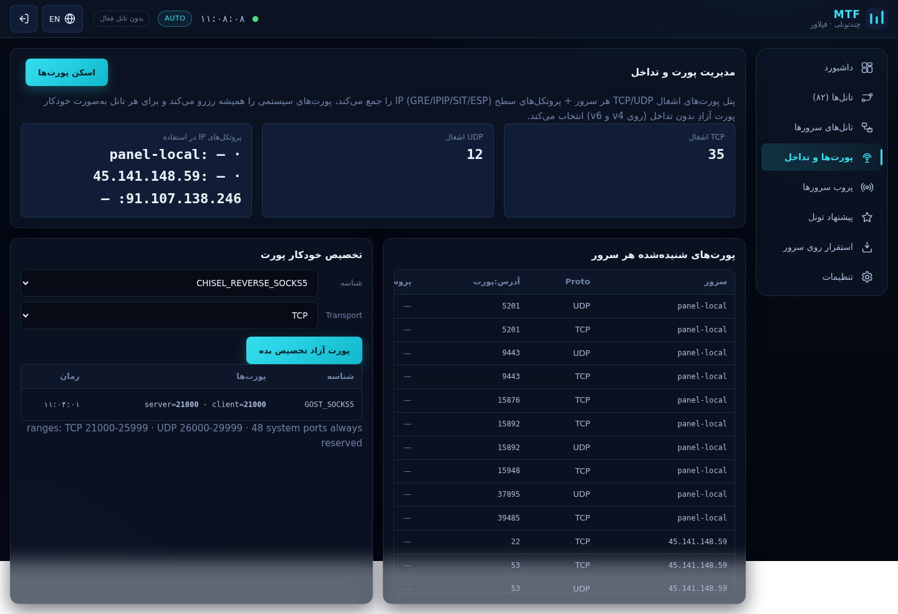
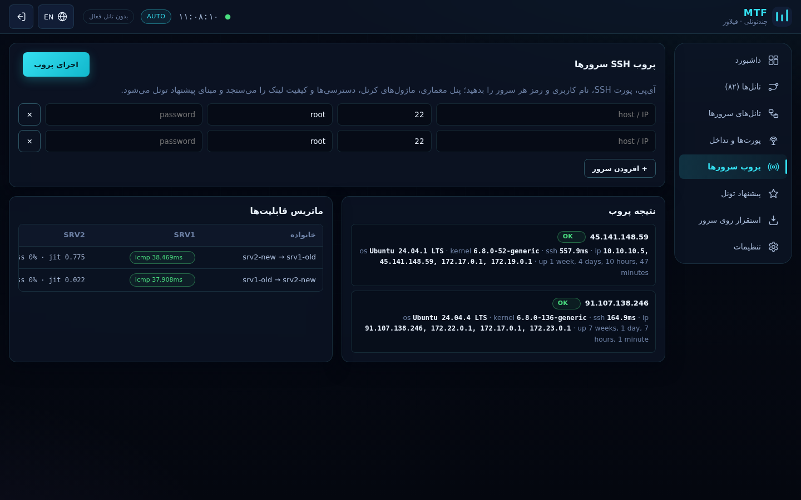
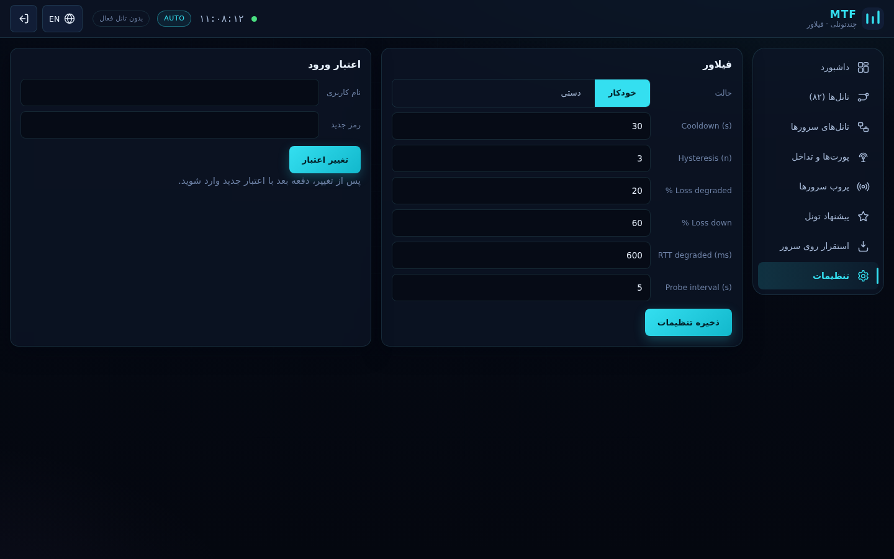
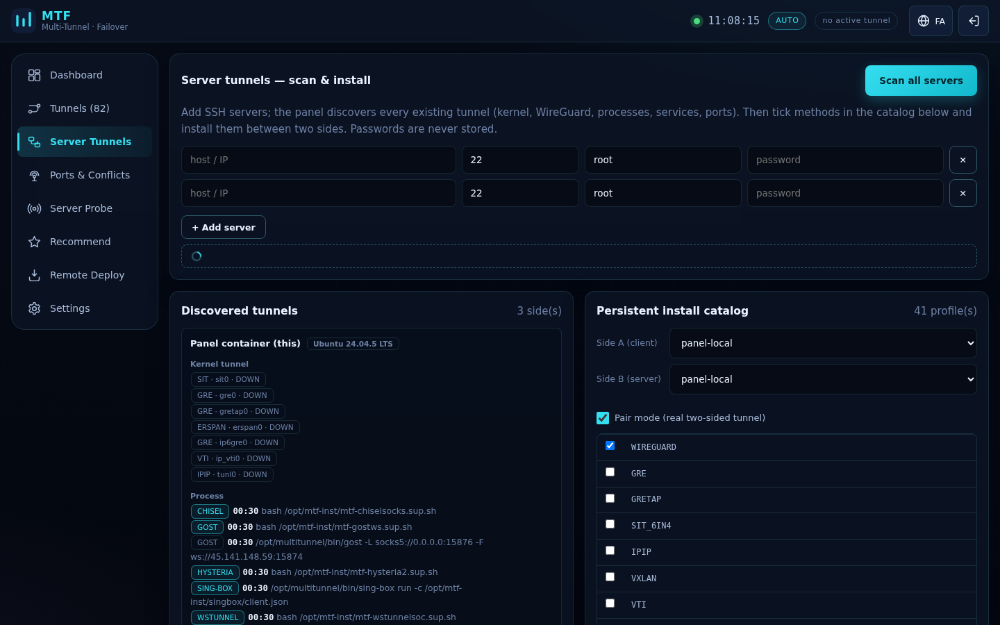

# MTF — Multi-Tunnel Failover Panel

[]()
[]()
[]()
[]()

**MTF** is a self-hosted, bilingual (fa/en, RTL/LTR) monitoring + failover panel that
tests **82 real tunnel methods**, watches servers with live charts, discovers every
tunnel already running on your machines, installs new persistent tunnels **with
one click**, and **auto-picks conflict-free ports** on both IPv4 and IPv6.

> 🇮🇷 نسخهٔ فارسی: [README-fa.md](README-fa.md)
> Agent contract: [AGENTS.md](AGENTS.md) · 82-method test report: [docs/TEST-REPORT.md](docs/TEST-REPORT.md)

---

## Screenshot tour

| # | Tab | Screenshot |
|---|-----|------------|
| 1 | Dashboard (fa) |  |
| 2 | Tunnels — 82 methods (fa) |  |
| 3 | Server Tunnels — scan & install (fa) |  |
| 4 | Ports & Conflicts (fa) |  |
| 5 | Server Probe (fa) |  |
| 6 | Settings (fa) |  |
| 7 | Server Tunnels (en, LTR) |  |

---

## 1. Every button and section, explained

### 1.1 Top bar

| Element | What it does |
|---|---|
| **Logo + MTF** | Brand mark; the three bars echo tunnel activity. |
| **Pulse dot + clock** | Live heartbeat of the panel; updates every second. |
| **AUTO / MANUAL badge** | Current failover mode. Cyan = auto, amber = manual. |
| **Active tunnel badge** | Shows which tunnel currently carries the VIP `10.10.10.5`; “no active tunnel” when idle. |
| **EN / FA globe button** | Toggles the whole UI between Persian (RTL) and English (LTR); choice is remembered in `localStorage`. |
| **Door icon** | Logout — clears the session cookie. |

### 1.2 Side rail (8 tabs)

| Tab | Purpose |
|---|---|
| **Dashboard** | KPIs + 6 live charts + event timeline. |
| **Tunnels (82)** | The full 82-method registry: select, apply, manual-switch. |
| **Server Tunnels** | Scan servers for existing tunnels + one-click persistent install between two sides. |
| **Ports & Conflicts** | Port/protocol conflict scanner and auto port assignment. |
| **Server Probe** | SSH probe of user-supplied servers (OS, kernel, link quality). |
| **Recommend** | Ranked tunnel suggestions per server pair. |
| **Remote Deploy** | Run the full 82-method test harness on a real target over SSH. |
| **Settings** | Failover thresholds, mode, and panel credentials. |

### 1.3 Dashboard tab

| Widget | Reading |
|---|---|
| **Active tunnel / VIP / UP-total / Mode** KPI cards | Live failover state at a glance. |
| **Host health — CPU / RAM** area chart | 10-minute rolling window sampled every 5 s from `/proc`; direct value labels (not color-only). |
| **Network traffic** RX/TX lines | Per-second bytes rate on the host; RX solid cyan, TX dashed amber. |
| **82 methods state** donut | UP / Degraded / Deploying / Error / Stopped share, with a numeric legend table. |
| **Health score gauge** | 0–100 composite: verified tunnels + host CPU headroom + zero-error bonus. |
| **Live events** timeline | Every login, deploy, probe, switch — newest first, with severity dot. |
| **Best tunnels latency** bar chart | Lowest-RTT methods from the last probe, direct ms labels. |

### 1.4 Tunnels tab (82 methods)

| Control | Behaviour |
|---|---|
| **Search box** | Filters by ID / name (live). |
| **Starred checkbox** | Shows only the three signature families: HEDIOUM, HAJSAMAN, PAQET. |
| **Family chips** | 13 families (SSH, GOST, FRP, RATHOLE, CHISEL, WSTUNNEL, VPN, XRAY, SING-BOX, WATERWALL, PAQET, COMPOSITE, KERNEL). |
| **Row checkboxes** | Queue methods for deployment. |
| **Apply selected** | Deploys + verifies each queued method via the kernel/userspace harness; state becomes UP / DEGRADED / ERROR with receipts. |
| **Manual switch** | Points the VIP routing at that method and flips the panel to manual mode. |
| **Receipts table** | Latest PASS/PARTIAL/FAIL verdicts with raw evidence. |

### 1.5 Server Tunnels tab — scan & one-click install

| Control | Behaviour |
|---|---|
| **Server rows (host / port / user / pass)** | Any number of SSH targets. **Passwords are never stored** — used in memory for the scan/install, then dropped. |
| **+ Add server** | Appends another row. |
| **Scan all servers** | SSHes into every side (plus the panel itself) and discovers: kernel tunnel interfaces (GRE/SIT/IPIP/VXLAN/VTI/ERSPAN…), WireGuard peers, userspace processes (gost, xray, sing-box, chisel, frp, rathole, wstunnel, hysteria, tuic, …), systemd units and listeners — everything tagged `panel's` if MTF created it. |
| **Side A / Side B selectors** | Pick the two ends of the new tunnel (A = client, B = server). |
| **Pair mode checkbox** | ON = a real two-sided tunnel (systemd units on both hosts); OFF = single-side client. |
| **Install catalog (41 profiles)** | Tick any method — WIREGUARD, GRE, VXLAN, VTI, IP6GRE, OPENVPN, GOST×4, CHISEL×2, WSTUNNEL×2, RATHOLE×2, FRP×3, VLESS×7, HYSTERIA2, TUIC, TROJAN, SHADOWSOCKS, SSH×3 — then press **Install ticked methods**. |
| **Install job bar + log** | Live per-method progress and raw SSH log lines. |
| **Installed book table** | Every installed tunnel per server with verdict and unit name; **حذف شد / Remove** tears down units, interfaces, configs and frees the port. |

### 1.6 Ports & Conflicts tab (public-server safety)

| Control | Behaviour |
|---|---|
| **Scan ports** | Collects every TCP/UDP listener on every side (`ss -tulnpH`). |
| **TCP busy / UDP busy / IP protocols** stat cards | 47+ listeners found in the live demo; IP-level usage shows GRE/IPIP/SIT/ESP occupancy. |
| **Listeners table** | Side · proto · port per machine — the “who owns what” map. |
| **Auto port assignment** | Pick method + transport → the manager picks a port that is: inside its safe range (TCP 21000–25999, UDP 26000–29999), free on **all** sides, not in the 48 system-port never-list (22, 53, 80, 443, 3306, 5432, 6379, 9443…), not previously allocated. Works identically for v4 and v6 because the check reads both listener tables. |
| **Allocations table** | Current assignments with release buttons. Deploy automatically re-scans and re-verifies before writing configs. |

### 1.7 Server Probe tab

| Control | Behaviour |
|---|---|
| **Server rows + Run probe** | SSH-fingerprints each server: OS, kernel release, SSH latency, global IPs, uptime. |
| **Probe result cards** | OK/FAIL badge per host with details. |
| **Capability matrix** | Pairwise link quality: ICMP (or TCP-fallback) RTT, loss %, jitter. |

### 1.8 Recommend tab

- **Compute** ranks every probed pair (0–100 score) and lists the best tunnel
  families per link with **bilingual reasons** (e.g. “lossy link → WaterWall /
  paqet on QUIC recover best”, “UDP blocked → chisel on pure TCP”).
- The three owner-picked families (HEDIOUM, HAJSAMAN, PAQET) are always listed.

### 1.9 Remote Deploy tab

| Control | Behaviour |
|---|---|
| **Host / SSH port / user / pass** | Target machine. |
| **All verified methods** checkbox | Deploys PASS+PARTIAL set; untick it to use the selection from the Tunnels tab. |
| **Start deploy** | Streams per-method results into the results table (verdict + evidence). |

### 1.10 Settings tab

| Control | Behaviour |
|---|---|
| **Mode segment** | Auto failover vs manual (auto probes, manual keeps your pick). |
| **Cooldown / Hysteresis / Loss-degraded / Loss-down / RTT-degraded / Probe-interval** | The full FSM tuning surface. |
| **Save settings** | Persists thresholds; the engine applies them live. |
| **Credentials card** | Change panel username/password (stored in `data/panel_secret.json`). |

---

## 2. What makes it unique

- **Ops-console design system** — built token-first (primitive → semantic →
  component) following the ui-ux-pro-max methodology: WCAG-AA contrast on a deep
  navy canvas, cyan/amber data accents, 4/8 spacing rhythm, SVG icon set (zero
  emoji icons), focus-visible rings, reduced-motion support, and a fully
  self-drawn **zero-dependency SVG chart engine** (line/area, bars, donut, gauge)
  with direct value labels and keyboard-focusable charts.
- **Bilingual by design** — one dictionary drives fa (RTL, Vazirmatn) and en
  (LTR); direction flips with zero layout breakage.
- **Zero CDN** — fonts, icons, JS and CSS are all served from the container; it
  runs on air-gapped boxes.

## 3. Networking features

| Feature | How |
|---|---|
| **Port conflict manager** | Live `ss` scan per side + IP-protocol occupancy + reserved system ports + allocation ledger. |
| **Auto port assignment** | Deterministic ranges (TCP 21000–25999, UDP 26000–29999) verified free on **all** sides before install; the deploy pipeline re-scans at runtime. |
| **IPv4 + IPv6** | Userspace servers bind dual-stack (`::` with v4-mapped); WireGuard/GRE/IPIP/VXLAN/VTI get inner `fd00:173:x::/126` addresses alongside v4; SIT/IP6GRE/IP6GRETAP/VTI6 run natively over v6 with automatic global-v6 detection. |
| **Multi-distro install** | Package detection across apt / dnf / yum / zypper / pacman / apk with a per-family package map (`wireguard-tools`, `openvpn`, `iproute(iproute2)`, …); firewall opening via ufw → firewalld → nftables/iptables fallback. |
| **Persistent installs** | systemd units on real hosts + supervisor loops inside the container, auto-restarted at panel boot. |

## 4. Quick start

```bash
# on the panel host (any x86_64 Linux with Docker)
sudo mkdir -p /opt/multitunnel && cd /opt/multitunnel
# place: engine/ panel/ docker/ bin/ certs/ (see repo layout)
docker network create mtfnet 2>/dev/null || true
docker run -d --name mtf-panel --restart unless-stopped \
  --network mtfnet -p 9443:9443 \
  --privileged --network_mode host \
  -v /opt/multitunnel/engine:/opt/multitunnel/engine \
  -v /opt/multitunnel/panel:/opt/multitunnel/panel \
  -v /opt/multitunnel/bin:/opt/multitunnel/bin \
  -v /opt/multitunnel/data:/opt/multitunnel/data \
  -v /opt/multitunnel/logs:/opt/multitunnel/logs \
  -v /opt/multitunnel/certs:/opt/multitunnel/certs \
  mtf-panel:2.0
# login: https://<host>:9443  (bootstrap password printed once at /api/password-hint)
```

The panel keeps its credentials in `/opt/multitunnel/data/panel_secret.json` and
prints a one-time bootstrap password until the first login — change it in
**Settings → Credentials** immediately.

## 5. Architecture

```
┌──────────────────────── browser (fa RTL / en LTR) ────────────────────────┐
│  SVG charts · i18n dictionary · no CDN · localStorage lang/mode           │
└──────────────▲────────────────────────────────────────────────┬──────────┘
               │ HTTPS :9443                                    │
┌──────────────┴──────────────── mtf-panel (Docker) ────────────▼──────────┐
│ FastAPI  /api/methods /api/status /api/metrics /api/st/* /api/ports/*    │
│ ├─ core.py        failover FSM + VIP 10.10.10.5 policy routing (tbl 51000)│
│ ├─ registry.py    82 methods / 13 families                               │
│ ├─ probe_engine.py SSH fingerprint + pairwise RTT/loss/jitter            │
│ ├─ servertunnels.py scan sides · persistent systemd installs · book      │
│ ├─ st_profiles.py  41 persistent profiles (kernel + userspace)           │
│ ├─ portmgr.py      conflict scan + auto port assignment (v4+v6)          │
│ └─ metrics.py      /proc sampler → 240-pt ring → JSON history            │
└──────────────────────────────────────────────────────────────────────────┘
```

## 6. API reference (cookie-authenticated)

| Endpoint | Method | Purpose |
|---|---|---|
| `/api/methods` | GET | 82-method registry with live state |
| `/api/methods/select` `/apply` | POST | queue + deploy+verify |
| `/api/manual/{id}` | POST | VIP switch to one method |
| `/api/mode` | POST | auto / manual |
| `/api/status` | GET | counters, settings, events |
| `/api/metrics` | GET | live host sample + 120-pt history |
| `/api/st/scan` | GET/POST | discover tunnels on all sides |
| `/api/st/deploy` | POST | persistent two-sided install |
| `/api/st/remove` | POST | tear down one install |
| `/api/ports/scan` `/report` `/assign` `/release` `/protos` | GET/POST | port manager |
| `/api/probe` | GET/POST | SSH probe |
| `/api/recommend` | GET | ranked suggestions |
| `/api/install` | GET/POST | 82-method remote harness |
| `/api/credentials` | POST | change login |

## 7. Security notes (read this!)

- The panel exposes **only port 9443** (TLS). Everything else stays inside the
  Docker network.
- SSH passwords for scans/installs live **in memory only**.
- ⚠️ During development some credentials were shared in chat; **rotate the root
  passwords of both servers, the panel password, and the GitHub token** before
  relying on this deployment.

## 8. License

MIT — see [LICENSE](LICENSE).
